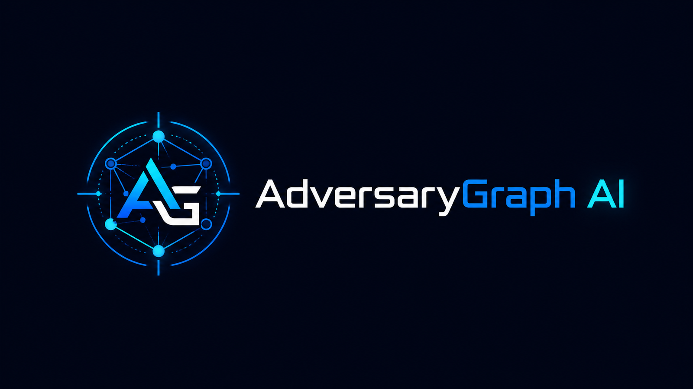

# AdversaryGraph v2.5: New Name, New Release, Full AI CTI Platform Capability Map

## From ThreatMapper To AdversaryGraph




This release marks an important transition for the project: the tool now has a new canonical name.

The project is now **AdversaryGraph**.

The rename was necessary because the previous name overlapped with an existing product/company name. Rather than create confusion, I changed the project identity and rebuilt the public references around a clearer name.

AdversaryGraph is a better name for what the platform actually does:

- it connects adversaries, reports, IOCs, malware, campaigns, sectors, and ATT&CK techniques;
- it helps analysts move from raw intelligence to structured graph-like context;
- it supports investigation, enrichment, comparison, and detection engineering handoff;
- it is not just a map of threats, but a working graph of adversary behavior and evidence.

The repository, documentation, release notes, public project hub, article links, and ecosystem pages were updated to use the new name. Legacy public links are preserved where possible through redirects or compatibility pages.

Project:
https://github.com/anpa1200/adversarygraph

Documentation:
https://1200km.com/adversarygraph-docs/

Project hub:
https://1200km.com/adversarygraph/

Use cases:
https://1200km.com/adversarygraph/use-cases.html

## Table of Contents

- [From ThreatMapper To AdversaryGraph](#from-threatmapper-to-adversarygraph)
- [What AdversaryGraph Is](#what-adversarygraph-is)
- [Installation Guide](#installation-guide)
- [What Is New In v2.5](#what-is-new-in-v25)
- [IOC Library](#ioc-library)
- [VirusTotal Enrichment](#virustotal-enrichment)
- [STIX, TAXII, MISP, And Custom Feeds](#stix-taxii-misp-and-custom-feeds)
- [YARA, Sigma, And Sandbox Behavior](#yara-sigma-and-sandbox-behavior)
- [AI Report Analysis](#ai-report-analysis)
- [ATT&CK And ATLAS Navigator](#attck-and-atlas-navigator)
- [Actor And Campaign Comparison](#actor-and-campaign-comparison)
- [Sector Intelligence](#sector-intelligence)
- [IOC-To-TTP Mapping](#ioc-to-ttp-mapping)
- [DFIR Examples](#dfir-examples)
- [Operations And Pipeline](#operations-and-pipeline)
- [Two-Database Architecture](#two-database-architecture)
- [Selftest And Troubleshooting](#selftest-and-troubleshooting)
- [Use Cases](#use-cases)
- [Licensing Change](#licensing-change)
- [What This Release Means](#what-this-release-means)
- [Who Should Use It](#who-should-use-it)
- [Final Thought](#final-thought)

## What AdversaryGraph Is


AdversaryGraph is a self-hosted AI-assisted CTI-to-detection workbench.

It helps analysts:

- map threat reports to MITRE ATT&CK;
- compare extracted TTPs against known actors and campaigns;
- enrich IOCs with external and local context;
- connect observables to actors, malware, reports, and techniques;
- build ATT&CK Navigator layers;
- review sector-relevant actor activity;
- create detection engineering backlogs;
- export analyst-ready evidence.

The platform is designed for practical CTI work, not marketing dashboards.

It is built around one idea:

> Raw intelligence becomes useful only when it is reviewed, structured, connected to evidence, and handed off in a form other teams can use.

AdversaryGraph does not perform definitive attribution. Actor similarity, TTP overlap, IOC enrichment, and external feed matches are analytical signals. They help generate hypotheses and prioritize work, but the analyst still validates the evidence.

## Installation Guide


For a fresh local deployment, use Docker Compose.

```bash
git clone https://github.com/anpa1200/adversarygraph.git
cd adversarygraph
cp .env.example .env
```

Open `.env` and configure at least one LLM provider.

For a cloud provider:

```env
ANTHROPIC_API_KEY=your_key_here
MINIMAX_API_KEY=your_key_here
```

For a local OpenAI-compatible endpoint such as Ollama, LM Studio, LocalAI, or vLLM:

```env
LOCAL_LLM_BASE_URL=http://host.docker.internal:11434/v1
LOCAL_LLM_API_KEY=local
LOCAL_LLM_MODEL=llama3.1:8b
```

Then configure optional enrichment keys and feeds.

These keys are not required for the basic ATT&CK matrix, actor library, or local report analysis. They are used when you want IOC enrichment, actor-linked observables, source-backed feed sync, or external reputation context.

```env
# abuse.ch ThreatFox IOC sync.
# Used for recent malware and botnet observables.
# If this is set, AdversaryGraph can sync ThreatFox on startup and during dynamic DB refresh.
THREATFOX_AUTH_KEY=your_abuse_ch_auth_key
AUTO_THREATFOX_SYNC_ON_STARTUP=true
AUTO_THREATFOX_SYNC_DAYS=7

# AlienVault OTX pulse enrichment.
# Used to search actor-attributed pulses and import source-backed IOCs.
OTX_API_KEY=your_otx_key

# VirusTotal on-demand enrichment.
# Used when an analyst clicks enrichment/check for an IP, domain, URL, or hash.
# Displays reputation, detections, tags, relationships, malware context, and possible TTP/actor hints.
VIRUSTOTAL_API_KEY=your_virustotal_key

# Daily dynamic DB refresh schedule in UTC.
# Refreshes public reference and configured intelligence sources.
DYNAMIC_DB_SYNC_HOUR=3
DYNAMIC_DB_SYNC_MINUTE=30
DYNAMIC_DB_IOC_SYNC_DAYS=7
```

Feed behavior:

- **MITRE ATT&CK / ATLAS**: no API key required. AdversaryGraph downloads public STIX bundles and builds the local matrix, actor, campaign, and technique database.
- **MISP Galaxy**: no API key required for the built-in public Galaxy sync. It enriches actors with aliases, sectors, regions, motivations, and evidence where available.
- **ThreatFox**: requires `THREATFOX_AUTH_KEY`. Best for recent IOC sync and malware-family context.
- **OTX**: requires `OTX_API_KEY`. Best for actor-attributed pulse search and IOC enrichment.
- **VirusTotal**: requires `VIRUSTOTAL_API_KEY`. Best for on-demand IOC investigation, relationship review, malware context, and possible ATT&CK hints.
- **Malpedia**: used as a public malware-family reference source where available. If a future private/API-backed Malpedia workflow is added, configure it separately.
- **MISP exports**: full MISP server authentication is not embedded in the default deployment. Use a MISP event or attribute JSON export URL, or a local gateway URL, from the IOC Library feed connector.
- **STIX/TAXII**: no global `.env` key is required by default. Use IOC Library to import STIX bundles or pull a TAXII 2.1 collection objects URL. If your TAXII endpoint needs a token, provide it in the TAXII pull form.
- **Custom feeds**: add JSON, CSV, or TXT feed URLs from IOC Library. Use this for private customer feeds, internal exports, or lab data.
- **Sigma/YARA feeds**: connect rule feed URLs from the pipeline/detection workflow. These are used for detection-rule context and IOC/malware behavior enrichment.
- **Sandbox behavior feeds**: connect sandbox or malware-behavior export feeds when available. These help convert IOC-only context into behavior and possible ATT&CK mappings.

Keep enrichment keys private. Do not commit a filled `.env` file. For team deployments, store secrets in your deployment secret manager or inject them through your orchestrator.

Start the platform:

```bash
docker compose up -d --build
```

Open the local interfaces:

- Frontend: `http://localhost:3000`
- API health: `http://localhost:8000/api/health`
- API docs: `http://localhost:8000/docs`

Run the selftest:

```bash
./scripts/selftest.sh
```

On first startup, AdversaryGraph downloads and ingests MITRE ATT&CK and MITRE ATLAS reference data. This can take a few minutes. If the matrix is empty immediately after startup, wait for the sync to finish, refresh the page, or open the troubleshooting page from the app.

The detailed installation and operations documentation is here:

https://1200km.com/adversarygraph-docs/getting-started/

## What Is New In v2.5


Version 2.5 is the IOC Library, enrichment, and connector-hardening release.

The earlier versions focused heavily on ATT&CK mapping, actor comparison, AI report analysis, local LLM support, MITRE sync, ATLAS support, DFIR examples, sector intelligence, and actor IOC tabs.

Version 2.5 expands the platform into a more complete observable and enrichment workspace.

The major additions are:

- central IOC Library;
- searchable multi-select actor/group filtering;
- VirusTotal IOC enrichment;
- IOC-to-TTP mapping;
- STIX import/export;
- TAXII pull support;
- MISP JSON import;
- custom JSON/CSV/TXT IOC feeds;
- YARA and Sigma rule-feed synchronization;
- sandbox behavior enrichment;
- dynamic DB sync reliability fixes;
- updated personal/private-use license model.

## IOC Library


The new IOC Library is the central observable workspace.

It allows analysts to search, filter, sort, enrich, and export indicators from multiple sources.

Supported use cases include:

- search all known observables;
- filter by IOC type;
- filter by source;
- filter by one or more ATT&CK groups or actors;
- sort by last seen, first seen, type, value, source, confidence, and actor context;
- enrich a selected indicator;
- export filtered results.

This matters because IOCs usually arrive fragmented.

They may come from:

- ThreatFox;
- OTX;
- Malpedia;
- MISP exports;
- TAXII/STIX feeds;
- custom customer feeds;
- uploaded reports;
- DFIR writeups;
- private investigations.

AdversaryGraph keeps these observables searchable in one place while preserving source labels.

## VirusTotal Enrichment


Version 2.5 adds a cleaner VirusTotal lookup workflow.

An analyst can check:

- IP addresses;
- domains;
- URLs;
- MD5 hashes;
- SHA1 hashes;
- SHA256 hashes.

The platform displays structured enrichment instead of raw API noise.

The enrichment view can show:

- verdict and reputation context;
- detection statistics;
- tags;
- categories;
- related objects;
- rule context;
- sandbox context;
- possible malware links;
- possible actor links;
- extracted ATT&CK technique hints;
- local actor matches;
- links back to the matrix and My TTPs.

The important part is not just checking if an IOC is malicious.

The useful workflow is:

1. check the observable;
2. inspect context;
3. identify related malware, actor, or behavior;
4. map useful findings back to ATT&CK;
5. decide whether the IOC is block, hunt, monitor, or context-only.

## STIX, TAXII, MISP, And Custom Feeds


AdversaryGraph v2.5 adds more ways to exchange and ingest structured intelligence.

Supported workflows include:

- export IOC records as STIX 2.1;
- import STIX bundles;
- pull TAXII collection objects;
- connect MISP JSON exports;
- register custom JSON feeds;
- register custom CSV feeds;
- register custom TXT feeds.

This is important because every CTI team already has different sources.

Some teams use MISP.
Some use OpenCTI.
Some receive TAXII collections.
Some maintain private CSVs.
Some have customer-specific IOC lists.

AdversaryGraph does not force all data into one external platform first. It lets the analyst bring those sources into a local self-hosted workflow and review them in context.

## YARA, Sigma, And Sandbox Behavior


The release also adds rule-feed and sandbox-behavior context.

YARA and Sigma feeds help answer:

- are there existing rules related to this malware or IOC?
- do public or private detection rules mention the same behavior?
- can the CTI finding become detection engineering work?

Sandbox behavior feeds help answer:

- what did the malware do at runtime?
- does behavior support an ATT&CK mapping?
- is the mapping based on direct behavior or only on a static indicator?
- can a detection be built from process, network, file, registry, or command behavior?

This moves the platform further away from simple IOC lookup and closer to CTI-to-detection engineering.

## AI Report Analysis


AdversaryGraph still includes the AI-assisted report analysis workflow.

Analysts can:

- upload PDF reports;
- upload DOCX files;
- upload TXT files;
- paste report text;
- choose a cloud LLM provider;
- use a local/private OpenAI-compatible LLM;
- stream ATT&CK extraction;
- review evidence;
- accept, reject, or mark findings as needs-evidence;
- inject accepted TTPs into Navigator;
- export results.

Supported provider directions include:

- Claude;
- OpenAI-compatible APIs;
- Gemini;
- MiniMax;
- local LLM endpoints such as Ollama, LM Studio, LocalAI, or vLLM when configured.

The purpose is not to blindly trust the model.

The purpose is to reduce repetitive extraction work while keeping analyst review central.

## ATT&CK And ATLAS Navigator


AdversaryGraph includes matrix support for:

- MITRE ATT&CK Enterprise;
- MITRE ATT&CK Mobile;
- MITRE ATT&CK ICS;
- MITRE ATLAS.

The Navigator workflow supports:

- selecting TTPs manually;
- importing layers;
- loading actor TTPs;
- injecting AI-extracted TTPs;
- showing relevant sector TTPs;
- exporting ATT&CK Navigator JSON;
- comparing coverage;
- creating matrix visuals for reports and briefings.

This makes the matrix a working tool instead of a static image.

## Actor And Campaign Comparison


AdversaryGraph can compare selected TTPs against known actor and campaign profiles.

It uses TTP overlap and Jaccard similarity to rank possible matches.

This is useful for:

- investigation leads;
- hypothesis generation;
- campaign clustering;
- actor similarity review;
- detection prioritization;
- deciding which actor profiles to inspect first.

But the limitation is explicit:

> Similarity is not attribution.

Many actors share common techniques. The analyst still needs corroborating evidence such as targeting, malware, infrastructure, tooling, timing, victimology, language, procedure details, or external reporting.

## Sector Intelligence


AdversaryGraph includes sector-focused actor relevance workflows.

The analyst can filter by:

- sector;
- geography;
- technology/environment;
- activity window.

This is useful when a client asks a practical question:

> Which attackers matter to my sector and environment right now?

Instead of giving a generic threat landscape, the analyst can create a more focused view:

- relevant actors;
- why they are relevant;
- related TTPs;
- relevant campaigns;
- actor descriptions;
- matrix overlay;
- detection priorities.

This is especially useful for customer-facing CTI, vCISO-style reporting, SOC planning, and detection roadmap creation.

## IOC-To-TTP Mapping


Version 2.5 improves the ability to connect observables back to behavior.

IOC-to-TTP mapping can come from:

- imported reports;
- enrichment metadata;
- OTX context;
- Malpedia context;
- ThreatFox context;
- VirusTotal tags and relationships;
- custom feed metadata;
- sandbox behavior;
- YARA/Sigma rule context.

This is important because IOCs alone are fragile.

Domains expire.
IPs rotate.
Hashes change.

Behavior is more durable.

AdversaryGraph tries to help the analyst move from:

> indicator found

to:

> behavior understood

to:

> detection or hunt created.

## DFIR Examples


The platform also includes DFIR report examples.

These are useful for:

- analyst training;
- testing extraction workflows;
- validating ATT&CK mappings;
- comparing public report behavior;
- demonstrating report-to-analysis-to-comparison workflows.

The DFIR Examples workflow is useful because teams often need safe public material for demos and training instead of using private customer reports.

## Operations And Pipeline


AdversaryGraph is not only a single analysis screen.

The platform includes operational workflow concepts:

- investigations;
- evidence graph records;
- report intake;
- tracked actors;
- detection engineering lifecycle;
- reviewed report workflow;
- structured exports.

This helps support repeatable CTI-to-detection operations rather than one-off analysis.

## Two-Database Architecture

AdversaryGraph separates rebuildable public reference data from analyst/private data.

The model is:

- public reference data such as ATT&CK, ATLAS, and synced reference sources;
- private/custom data such as reports, custom IOCs, private feeds, and analyst work.

This is important for Docker deployments.

The application can be rebuilt while private/custom data remains in the external persistent data location when configured correctly.

## Selftest And Troubleshooting


The recent releases added clearer operational checks.

The platform includes:

- API health endpoint;
- selftest endpoint;
- visible error popups;
- recheck button;
- troubleshooting page;
- clearer missing-key errors;
- ATT&CK/ATLAS data checks;
- DB connectivity checks.

This matters because self-hosted tools should fail clearly.

If ATT&CK data is not loaded, an API key is missing, or a sync route fails, the analyst should not have to guess.

## Use Cases

I also created a structured use-case library for the project.

It contains:

- 10 simple use cases;
- 10 intermediate use cases;
- 5 complex investigation workflows;
- 5 complex defense and MITRE coverage workflows.

Examples include:

- check one IOC;
- open one actor profile;
- map a report to ATT&CK;
- compare incident TTPs to actors;
- build a sector threat brief;
- import MISP JSON;
- pull TAXII or import STIX;
- sync YARA and Sigma feeds;
- investigate a ransomware intrusion;
- investigate a cloud/Kubernetes incident;
- cluster multiple APT reports;
- build a MITRE coverage baseline;
- create a sector detection roadmap;
- build an IOC enrichment pipeline;
- create detection content from CTI;
- prepare an executive risk and coverage report.

The public use-case page is here:

https://1200km.com/adversarygraph/use-cases.html

## Licensing Change

The license has changed.

AdversaryGraph is now under the **AdversaryGraph Personal Use License**.

Personal/private use is free.

Business, commercial, organizational, client-delivery, production, or government use requires prior written approval from Andrey Pautov.

This change is intentional.

The project is still available for personal research, learning, private lab use, and individual analyst workflows. But business or organizational use now requires approval.

## What This Release Means

AdversaryGraph v2.5 is no longer only an ATT&CK mapping tool.

It is becoming a broader self-hosted CTI workbench:

- reports come in;
- AI helps extract behavior;
- analysts review evidence;
- actors and campaigns provide context;
- IOCs are enriched;
- rules and sandbox behavior support detection;
- sector filters prioritize relevance;
- Navigator layers visualize the result;
- exports support handoff.

The platform is most useful when the analyst needs to connect:

- report text;
- actor behavior;
- observables;
- malware context;
- detection logic;
- ATT&CK coverage;
- client relevance;
- final deliverables.

## Who Should Use It


AdversaryGraph is useful for:

- CTI analysts;
- SOC analysts;
- detection engineers;
- threat hunters;
- malware analysts;
- incident responders;
- security researchers;
- consultants building customer threat briefs;
- teams building MITRE coverage and detection roadmaps.

It is especially useful when the analyst wants a private, self-hosted environment instead of sending reports and IOCs into a SaaS tool.


## Published Article Visual Asset Gallery

All screenshots and infographics mirrored from the published Medium article are stored locally so the documentation and 1200km mirror do not depend on Medium CDN availability.


## Final Thought

The main idea behind AdversaryGraph is simple:

> CTI should not stop at reading reports.

Good CTI should become:

- reviewed ATT&CK mappings;
- evidence-backed findings;
- actor and campaign hypotheses;
- enriched observables;
- detection priorities;
- Navigator layers;
- exportable reports;
- operational handoff.

That is what AdversaryGraph v2.5 is built to support.

Project:
https://github.com/anpa1200/adversarygraph

Documentation:
https://1200km.com/adversarygraph-docs/

Project hub:
https://1200km.com/adversarygraph/

Release:
https://github.com/anpa1200/adversarygraph/releases/tag/v2.5.0

Use cases:
https://1200km.com/adversarygraph/use-cases.html
